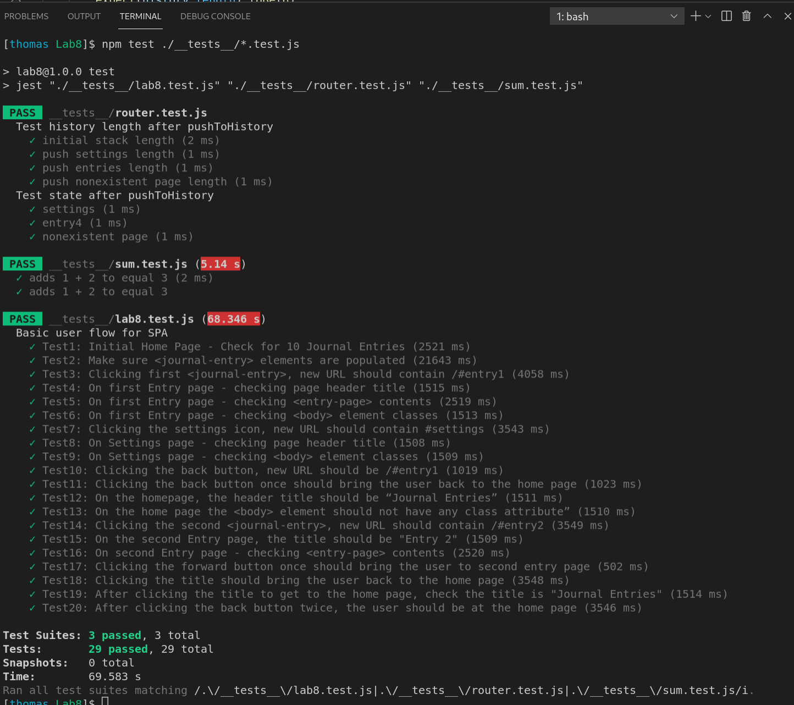

# Lab8 
## Author: Thomas Fischer
## Check your understanding q's (FILL OUT)
1. In your own words: Where would you fit your automated tests in your Bujo project development pipeline? (just write the letter)
    A. Within a Github action that runs whenever code is pushed.

2. Would you use a unit test to test the “message” feature of a messaging application? Why or why not? For this question, assume the “message” feature allows a user to write and send a message to another user.
    1. No, because the message feature has multiple components (writing and sending the message). It would be hard to debug a test failure because different parts of the code could be responsible.Also sending and receiving messages requires the network (or emulating it), so a test failure could be unrelated to the code.

3. Would you use a unit test to test the “max message length” feature of a messaging application? Why or why not? For this question, assume the “max message length” feature prevents the user from typing more than 80 characters
    1. Yes, because testing the max message length only requires testing one component.

4. What do you expect to happen if we run our puppeteer tests with the field “headless” set to true?
    Puppeteer will run tests on chromium without a UI, just interacting with the DOM.

5. What would your beforeAll callback look like if you wanted to start from the settings page before every test case?

    You should use `beforeEach`, because `beforeAll` only runs once before the first test.

    ```js
    beforeEach(() => await page.click('header > img')); // click the settings button before each test
    ```

    Although this depends on the settings button working. Ideally we could test that clicking the settings button works and skip the other tests if it fails. A `step` feature supporting this has been in development for over a year, but it doesn't look like it will be merged any time soon.

## Screenshot
